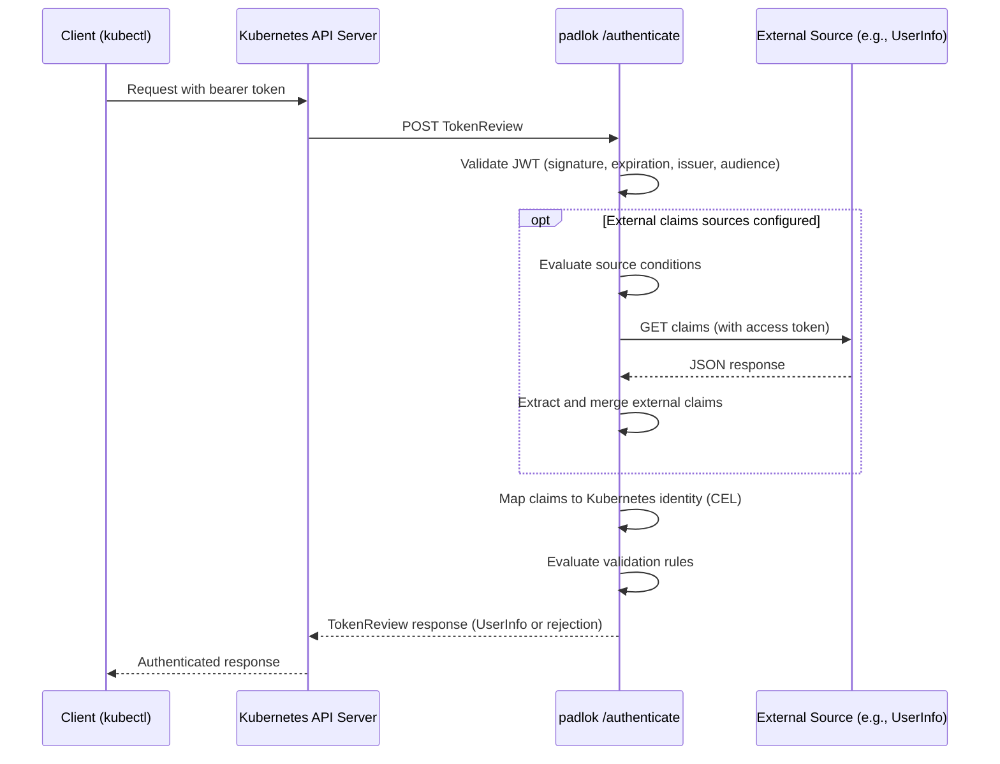

# Architecture

This page describes how `padlok` fits into the Kubernetes authentication flow. For background on how Kubernetes authentication works, see the [Kubernetes authentication documentation](https://kubernetes.io/docs/reference/access-authn-authz/authentication/).

## Authentication Flow

1. A client sends a request to the Kubernetes API server with a bearer token (typically a JWT obtained from an OIDC provider).
2. The API server constructs a `TokenReview` and sends it as an HTTP POST to `padlok`'s `/authenticate` endpoint. See [Webhook Token Authentication](https://kubernetes.io/docs/reference/access-authn-authz/authentication/#webhook-token-authentication) for the protocol details.
3. `padlok` validates the JWT:
   - Discovers the issuer's signing keys via [OIDC discovery](https://kubernetes.io/docs/reference/access-authn-authz/authentication/#openid-connect-tokens) (`/.well-known/openid-configuration` → JWKS endpoint).
   - Verifies the token's signature, expiration, issuer, and audience.
4. If external claims sources are configured, `padlok` evaluates their conditions and fetches additional claims from the configured HTTP endpoints. Fetched claims are merged into the token's claim set.
5. `padlok` maps the combined claims to a Kubernetes identity (username, groups, uid, extra) using the configured [claim mappings](claim-mappings.md).
6. Claim validation rules and user validation rules are evaluated. If any rule fails, authentication is rejected.
7. `padlok` returns a `TokenReview` response containing the authenticated `UserInfo` (or a rejection) to the API server.

## Components

### Server

`padlok` runs as an HTTPS server exposing a single endpoint: `/authenticate`. It accepts `TokenReview` POST requests from the Kubernetes API server and returns `TokenReview` responses. TLS is required — see [TLS Configuration](tls-configuration.md).

### JWT Authenticator

The JWT authenticator validates tokens using the upstream Kubernetes OIDC token authenticator logic. It handles OIDC discovery, key rotation, signature verification, and standard claim validation. Multiple JWT authenticators can be configured (one per issuer), and they are tried in order.

### Configuration Manager

The configuration manager reads the `AuthenticationConfiguration` file, validates it, and constructs the token authenticator pipeline. It watches the configuration file for changes and automatically rebuilds the authenticator when modifications are detected, using content hashing to avoid unnecessary churn. See [AuthenticationConfiguration](authentication-configuration.md).

### External Claims Resolver

When external claims sources are configured, the resolver:
1. Evaluates the source's conditions against the token's claims to decide whether to consult the source.
2. Obtains an access token using the configured authentication method (RequestProvidedToken, ClientCredential, or Anonymous).
3. Builds the request URL from the hostname and CEL path expression.
4. Makes an HTTPS GET request to the external source.
5. Extracts claims from the JSON response body using the configured CEL mapping expressions.
6. Merges the extracted claims into the token's claim set.

Each external source request has a 500ms timeout. Up to 5 external sources can be configured per JWT authenticator. See [External Claims Sources](external-claims-sources.md).

## Deployment Model

`padlok` is deployed as a standalone service accessible to the Kubernetes API server over the network. The API server is configured to use `padlok` via a [webhook token authentication configuration file](https://kubernetes.io/docs/reference/access-authn-authz/authentication/#webhook-token-authentication) that points to `padlok`'s `/authenticate` endpoint.

A typical deployment looks like:

- `padlok` runs as a container alongside (or accessible to) the API server.
- The API server is configured with `--authentication-token-webhook-config-file` pointing to a kubeconfig-style file that references `padlok`.
- `padlok` is configured with its own `AuthenticationConfiguration` file specifying the OIDC issuers, claim mappings, and optional external claims sources.

See [Installation](installation.md) for detailed setup instructions.
